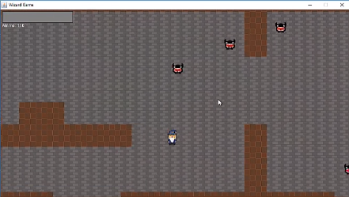
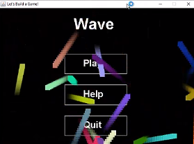
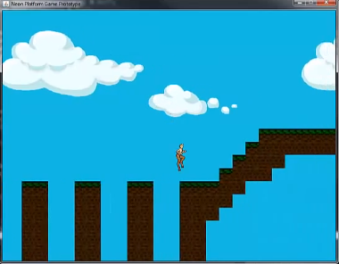

# java-game
In this assignment you will be developing a simple game in java. All development (coding, compilation, execution) will (`host take place remotelly on your Linux workstation (the one you set up in the [linux-server-assignment](https://github.com/mariopineda/linux-server-assignment)) using the Raspberry Pi as a remote terminal.

# Tools and Set Up
After obtaining the ip address of your Linux server (`hostname -I`) you can connect to it from your Raspberry Pi using ssh (`ssh -X <ip address>`). For this assignment you have the option of choosing the code editor of your choice. A few good choices are:
- [vim](https://www.vim.org/): console-based editor that is ubiquitous and exceptionally powerful
- [atom](https://atom.io/) or [sublime text](https://www.sublimetext.com/): state-of-the-art GUI code editors
- [Netbeans](https://netbeans.org/) or [Eclipse](https://www.eclipse.org/ide/): fully fledged GUI IDEs

Make sure your Linux server has the following software installed:
- the code editor of your choices
- git
- JDK
Depending on your Linux distribution the installation method will vary and depending on your choice of code editor additional software may need to be installed and configured.

# Java game
In this assignment you will be developing a simple java-based game by following along a video tutorial of your choice. You will choose of of the following tutorials:
- [Top Down Shooter game](https://www.youtube.com/playlist?list=PLWms45O3n--5vDnNd6aiu1CSWX3JlCU1n), 14 parts

- [Wave game](https://www.youtube.com/playlist?list=PLWms45O3n--6TvZmtFHaCWRZwEqnz2MHa), 15 parts

- [Platform game](https://www.youtube.com/playlist?list=PLWms45O3n--54U-22GDqKMRGlXROOZtMx), 17 parts

# Marking
- Up to 75%: Finishing one of the tutorial with a java game having the same functionality as in the tutorial (no modifications or extra features added).
- Above 75%: Original game has been extensivelly modified and extended with additional functionality.
